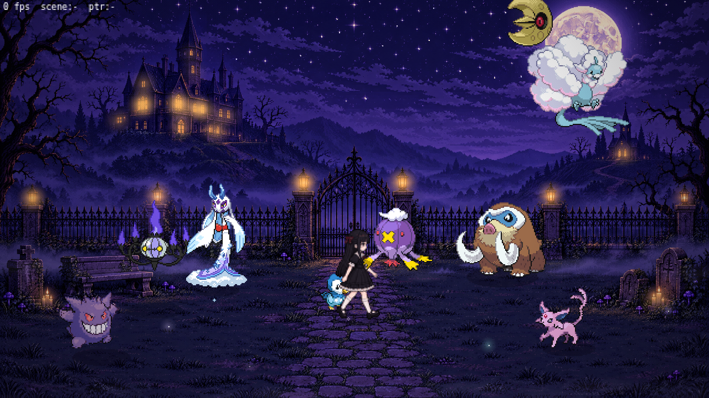

# Luna 🌙 — a haunted-garden pixel wallpaper

An interactive, animated pixel-art desktop wallpaper: a small gothic girl in a
black lolita dress lives in a moonlit graveyard with her Pokémon — **Gengar,
Chandelure, Mega Froslass, Mega Altaria, Piplup, Drifblim, Mamoswine, Lunatone
and Espeon** — and plays with them all night.



*The HD look: a Higgsfield-generated graveyard and Luna sprite. The original
hand-drawn version is still there (`docs/preview.png`) and can be switched
back on from the tray menu.*

## What it does

- Lives **behind your desktop icons** on Windows 10/11 (same technique as
  Wallpaper Engine / Lively), with a tray icon for settings.
- **Reacts to your cursor**: hover a Pokémon and it hops, sparkles or sings;
  Gengar and Drifblim drift curiously toward the cursor, Mega Froslass shyly
  slips away. Click a Pokémon and Luna walks over to pet it (hearts!). Click
  Luna and she waves. Click the ground and she walks there.
- **Little stories on their own**: Gengar sneaks up and startles her, she rides
  Mamoswine across the garden, Drifblim lifts her for a balloon ride, Mega
  Altaria lands to be petted, Mega Froslass waltzes around her in a flurry of
  snow, Piplup parades, Lunatone descends from the moon, Chandelure lights her
  way, and late at night she naps on the stone bench with Espeon and Piplup.
- **Living background**: dithered night sky, twinkling stars, drifting clouds,
  bats, shooting stars, a mansion with flickering windows, lanterns,
  will-o'-wisps and fog. The moon shows the **real lunar phase** for today.
- Pauses behind fullscreen apps, on the lock screen and while the PC sleeps.
  Caps itself at 30 fps (configurable) so it stays light.

## HD assets (Higgsfield)

The background picture and Luna's HD sprite sheet were generated with
Higgsfield (GPT Image 2.5): one 16:9 pixel-art graveyard, one character
design, and one 12-pose sheet drawn from that design as a reference. The
pipeline in `scripts/hd-assets.js` / `scripts/hd-build.js` downloads the
sources listed in `assets-hd.json`, cuts the pose sheet into frames, scales
them to a common pixel size, snaps the palette and packs
`src/renderer/assets/hd/luna.png`; it also analyses the picture to find the
stars, lanterns, windows and the moon so the renderer can twinkle, flicker
and orbit them.

```bat
npm run assets:hd:preview   # docs/hd/ previews of every candidate
npm run assets:hd           # rebuild src/renderer/assets/hd/ from assets-hd.json
```

The same thing runs in GitHub Actions (`.github/workflows/hd-assets.yml`,
"HD assets" → *build*) which commits the results to the branch. Tray menu:
**Luna** (HD sprite / classic), **Background** (HD picture / classic
procedural), **Picture detail** (full resolution / snapped to the pixel grid).

## Building it on Windows

Requires [Node.js](https://nodejs.org) 20+ (no Rust/VS build tools needed —
the Win32 calls go through [koffi](https://koffi.dev), which ships prebuilt).

```bat
npm install
npm start            # run the wallpaper now (tray icon appears)
npm run dist         # build release\Luna Setup 0.1.0.exe and the portable .exe
```

The sprites are already in the repo; `npm run assets` regenerates them
(downloads the Pokémon sprites and rebuilds the girl's sheet and icons).

Settings live in the tray menu (right-click the moon icon — Windows 11 hides
new tray icons under the `^` overflow button): pause, cursor reactions on/off,
resolution (automatic, or a 1080p / 1440p / 4K pixel-scale preset), frame
rate, space for the taskbar, which displays to cover, launch at login. *Quit*
restores your previous wallpaper.

While Luna runs, the Windows wallpaper is switched to a solid dark picture
(`%APPDATA%\Luna\luna-dark-wallpaper.png`): the translucent taskbar blurs the
static wallpaper, not the live scene, so without this it would show your old
picture. The original path is saved next to it and put back on quit, or on
the next start if a previous run was killed.

### Use it without Electron

The whole scene is a plain web page: `src/renderer/index.html`. It also works
as a web wallpaper in [Lively Wallpaper](https://github.com/rocksdanister/lively)
or Wallpaper Engine (drop the `src/renderer` folder in, enable mouse input
forwarding). URL options: `?scale=3`, `?fps=30`, `?inset=0`, `?interactive=0`,
`?debug=1`.

`npm run preview` serves it at http://localhost:8765/ for a quick look in any
browser (`npm start -- --window` opens it in a normal Electron window).

## How it is put together

```
src/renderer/        the scene (no bundler, classic scripts, works from file://)
  js/background.js   procedural sky / moon / mansion / graveyard / fog / bats
  js/entities.js     Luna + Pokémon behaviours, particles, speech bubbles
  js/director.js     the scripted scenes (generator functions)
  js/app.js          boot, input (DOM or Electron bridge), frame loop
  assets/            sprite sheets + manifests (generated)
src/main/            Electron: windows, tray, settings; wallpaper.js = Win32 via koffi
scripts/             asset pipeline (build-pokemon.js, build-girl.js, build-icons.js)
test/                headless Chromium screenshots + mocked main-process smoke test
```

Luna herself is drawn in `scripts/build-girl.js` as ASCII pixel layers (hair,
head, bodice, skirt, legs, arm overlays) composed into idle / walk / pet /
wave / sit / startle / reach / happy frames — edit the layers there to change
her look (hair colour, bow, dress) and run `npm run assets:girl`.

To rename her, search for `'luna'` in `src/renderer/js/entities.js`; the
Pokémon roster and personalities are the `SPECIES` table in the same file.

## Credits & notes

- Pokémon sprites are the Generation V (Black/White) battle sprites, fetched
  from the [PokeAPI sprites](https://github.com/PokeAPI/sprites) mirror; the
  Mega Froslass and Mega Altaria sprites are fan-made Black/White-style sprites
  hosted there as well. Pokémon is © Nintendo / Creatures Inc. / GAME FREAK —
  this is a personal, non-commercial fan project, please don't redistribute
  the sprites commercially.
- The HD background and Luna sprite sheet were generated with Higgsfield
  (GPT Image 2.5) for this project; the hand-drawn Luna, the procedural
  background and the icons are original. Everything that is ours is MIT licensed.
